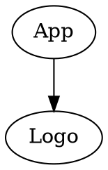

# WebFrameworks Part I (26543/1700/1920/1/00)

## Exercises on React Basics (I)

### Installation

Install the software of the list below. Make sure to check installation before moving to the next package.

- Install [Visual Studio Code](https://code.visualstudio.com/download)
- Install [Postman](https://www.getpostman.com/) or similar software
- Install and test [Node.js, npm  & Express.js](https://medium.com/@adnanrahic/hello-world-app-with-node-js-and-express-c1eb7cfa8a30)

Make sure you get acquainted with the above software, with priority for Visual Studio Code. You can do this by following the links on the welcome screen. Find anything interesting within base VS code or one of its plugins? Send your findings by email to the lector.

### Getting Started

- Prepare a folder on your disk where you will place all assignments
- Make a subfolder `my-first-react-app`
- Either run `npm init react-app my-first-react-app` or `npx create-react-app my-first-react-app` or copy the content of this [archive](./React_Template/hello-world-node.zip) into your sub-folder (=faster). This will create a ready-made application conveniently called the `create-react-app` or **CRA**.
- Start the application with `npm start`

> See the [create-react-app](https://create-react-app.dev/) website for more info

> Tip: You may have noticed it takes a while to start a new app. If you do not like to wait, or you want to be more electron-friendly, then keep a archived version of this ready-made app somewhere so you can re-use anytime you like.

If all goes well, you should see something like this:


Now, install the [React Developer Tools](https://chrome.google.com/webstore/detail/react-developer-tools/fmkadmapgofadopljbjfkapdkoienihi?hl=nl) and read a bit about it. We will later discover its use. For now, look at the Components tab in your dev tools and you should see something like this:


### Ex_01: Colorize the React Logo

As a first exercise, we will make a mini application that resembles this mockup screenshot:


#### Given

- A successful installation of the above software
- A CRA
- This [color picker](https://casesandberg.github.io/react-color/)

#### Assignment

The requirement is that the logo resides in a separate React component:



<small>Use [Graphviz Markdown Preview](https://marketplace.visualstudio.com/items?itemName=geeklearningio.graphviz-markdown-preview) plugin to view the above content graphically.</small>

- The `App` component must has a state that stores the `Color` that results from picking a color on the color picker
- The `Logo` component receives the prop `Color` from the `App` component and uses it to adjust the color of the logo

#### Solution

Paste the content of the resulting App.js and Logo.js files below:

```js (App.js)
PASTE CONTENT OF App.js HERE
```

```js (Logo.js)
PASTE CONTENT OF Logo.js HERE
```
