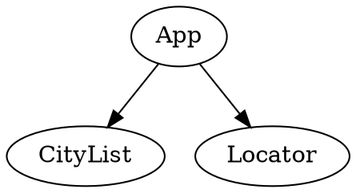

# WebFrameworks Part I (26543/1700/1920/1/00)

## Exercises on React Basics (II)

### Ex_02: City Locator

As a second exercise, you will build yourself an application to locate a city in Belgium:


#### Given

- A CRA
- This [Data](../Data/Gemeenten_België.txt)

#### Assignment

Make an application that allows for selecting a Belgian town from a list. Upon selection of a town, the app shows its location on an Open Street Map (OSM) component (thus __not__ Google Maps).

The app structure must be like this:



The `CityList` must show a standard HTML list element. Each element has to show only the name of the town or city. Upon selection it has to update the `Selected_Name` (in the state) but also alert the `App` component of the new selection somehow. The `CityList` component accepts a list of strings called `Cities` as a prop from the `App` component.

The `App` component will have a state called `Selected_Row`. Upon change, the `Locator` component needs to get updated somehow.

The `Locator` component accepts a prop called `Coordinates` which contains the `Longitude` and `Latitude` of the selected town or city, and accordingly places the icon.

You can choose the way you import the data and the icon you use to indicates the city's location. Try, however to have reversed colors (white font on dark background, unlike what is shown in the mockup above).

#### Solution

Paste the content of the resulting App.js, Locator.js and CityList.js files below:

```js (App.js)
PASTE CONTENT OF App.js HERE
```

```js (CityList.js)
PASTE CONTENT OF CityList.js HERE
```

```js (Locator.js)
PASTE CONTENT OF Locator.js HERE
```
