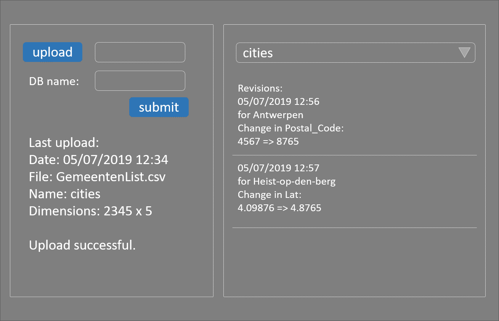

# WebFrameworks Part I (26543/1700/1920/1/00)

## Exercises on CouchDB

### Ex_05: CSV Import

#### Given

- Installed CouchDB
- CRA

#### Assignment

- Study the [couchimport repository](https://github.com/glynnbird/couchimport)
- Use the PouchDB and couchimport libraries to import csv files into a CouchDB database
- Allow the user to provide a name for the database
- Look at "10.4.1.2. Getting a List of Revisions" and following paragraphs in [this document](https://docs.couchdb.org/en/2.2.0/api/document/common.html)
- Provide the possibility to look into all revisions present on the data (only changed data)
- Let the user save the database back into a csv file (same name + date as version)
- Here is a mockup:

