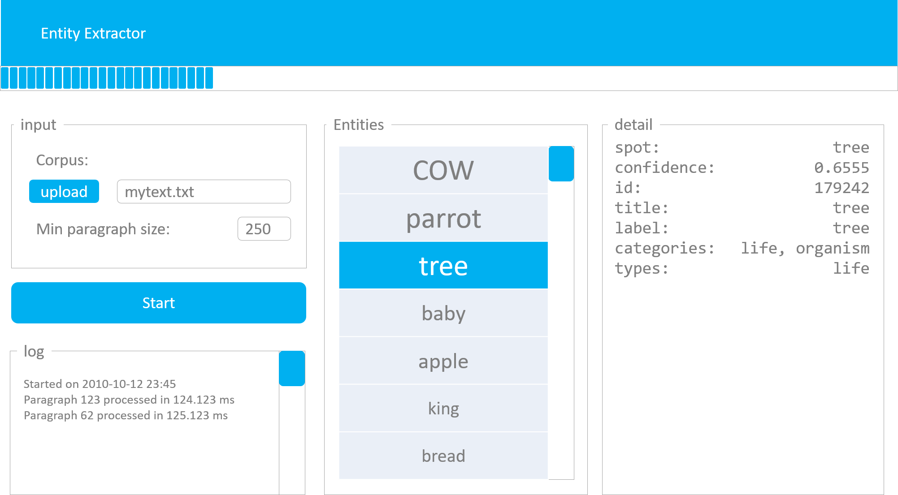

# WebFrameworks Part I (26543/1700/1920/1/00)

## Exercises on CouchDB

### Ex_05: CSV Import

#### Given

- The [Dandelion API](https://dandelion.eu/) for NLP
- CRA
- The code in the NLP solution of this course

#### Assignment

- Create an application that resembles this:

- You can choose any of the available text analysis algorithms available
- Make sure you follow the principles of 'divide and conquer':
  - break down the corpus into smaller bits (paragraphs)
  - send bits separately to the API endpoint
  - gather the results upon return of all calls
  - present the results
- place the input, the logs, the output en possible details into separate components
- Use a context so that each component is aware of the progress
