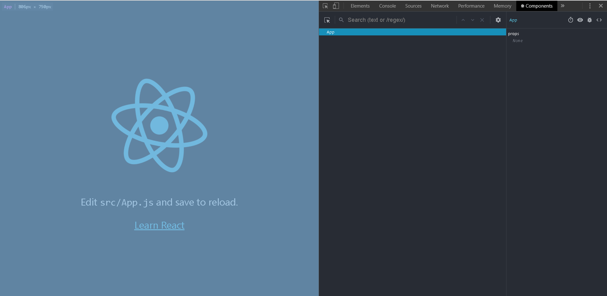
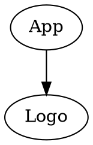
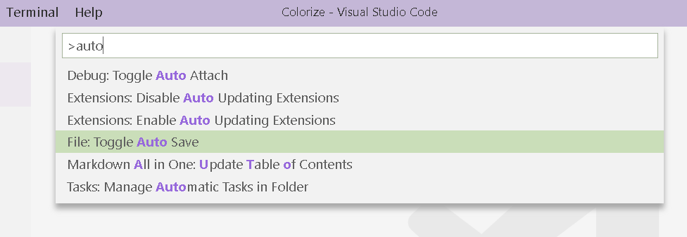

# WebFrameworks Part I (26543/1700/1920/1/00)

## Exercises on React Basics (I)

### Installation

Install the software of the list below. Make sure to check installation before moving to the next package.

- Install [Visual Studio Code](https://code.visualstudio.com/download)
- Install [Postman](https://www.getpostman.com/) or similar software
- Install and test [Node.js, npm  & Express.js](https://medium.com/@adnanrahic/hello-world-app-with-node-js-and-express-c1eb7cfa8a30)

Make sure you get acquainted with the above software, with priority for Visual Studio Code. You can do this by following the links on the welcome screen. Find anything interesting within base VS code or one of its plugins? Send your findings by email to the lector.

### Getting Started

- Prepare a folder on your disk where you will place all assignments
- Make a subfolder `my-first-react-app`
- Either run `npm init react-app my-first-react-app` or `npx create-react-app my-first-react-app` or copy the content of this [archive](./React_Template/hello-world-node.zip) into your sub-folder (=faster). This will create a ready-made application conveniently called the `create-react-app` or **CRA**.
- Start the application with `npm start`

> See the [create-react-app](https://create-react-app.dev/) website for more info

> Tip: You may have noticed it takes a while to start a new application. If you do not like to wait, or you want to be more electron-friendly, then keep a archived version of this ready-made application somewhere so you can re-use anytime you like.

If all goes well, you should see something like this:


Now, install the [React Developer Tools](https://chrome.google.com/webstore/detail/react-developer-tools/fmkadmapgofadopljbjfkapdkoienihi?hl=nl) and read a bit about it. We will later discover its use. For now, look at the Components tab in your dev tools and you should see something like this:



### Ex_01: Colorize the React Logo

As a first exercise, we will make a mini application that resembles this mockup screenshot:


#### Given

- A successful installation of the above software
- A CRA
- This [color picker](https://casesandberg.github.io/react-color/)

#### Assignment

The requirement is that the logo resides in a separate React component:



<small>Use [Graphviz Markdown Preview](https://marketplace.visualstudio.com/items?itemName=geeklearningio.graphviz-markdown-preview) plugin to view the above content graphically.</small>

- The `App` component must has a state that stores the `Color` that results from picking a color on the color picker
- The `Logo` component receives the prop `Color` from the `App` component and uses it to adjust the color of the logo

#### Solution

Let us solve this first exercise step-by-step.

##### Ready-made React Application

When you follow the steps in the `Getting Started` section above, a ready-to-start webb-app will be created for you. Here is an overview of the files in your application upon generation:


We will be working with the files indicated in <span style="color:red;">red</span>, but make sure you have a look at the other files too.

Before we have a look at the App component, make sure also to change the `name` setting in the `package*.json` files to `colorize`.

> Tip: In VS Code, set the auto-save feature to true. Press `F1` or `ctrl+shift+P` and choose `File: Toggle Auto Save`:



##### The App Component

In contrast to the in-page solution demonstrated during the [first theory lesson](WF_I_02_React_Basics.md), every component is placed in a separate file, either a JavaScript file (`*.js`) or a TypeScript file (`*.ts`). We will focus on JavaScript, here. The App component of a CRA is called `App.js` and it's content looks like this:

```jsx
import React from "react";
import logo from "./logo.svg";
import "./App.css";

function App() {
	return (
		<div className="App">
			<header className="App-header">
				
				<p>
					Edit <code>src/App.js</code> and save to reload.{" "}
				</p>
				<a
					className="App-link"
					href="https://reactjs.org"
					target="_blank"
					rel="noopener noreferrer"
				>
					Learn React
				</a>
			</header>
		</div>
	);
}

export default App;
```

> Remember that all Component names must be in `PascalCase`!

##### Importing and Exporting

On the top of the `App.js` you see a couple of import statements. The first one (`import React from "react";`) serves to allow the usage of JSX and corresponds to the `babel` type definition we saw for the in-page solution. The second one imports the vector-based React logo: `import logo from "./logo.svg";` and the third imports a stylesheet. Notice that these import statements can serve to import all kinds of different dependencies. In order to be able to import a dependency into a component, this dependency needs to export the necessary content. As the `App` component of the appication is itself being imported by `index.js` it also needs to be exported and that is why the last line states `export default App;`.

There are two important facts to remember when it comes to exporting something:

> An export can be set as default and in such a case, the import statement does not require a curly brace.

Let us compare both situations, first the regular export:

```js
// MyComponent.js
export class MyComponent extends Component {}

// App.js
import {MyComponent} from "./MyComponent";
```

and then the default export:

```js
// MyComponent.js
class MyComponent extends Component {}

export default MyComponent;

// App.js
import MyComponent from "./MyComponent";
```

Notice the need for curly braces in case the export is not default.

> We will encounter situations where erroneously omitting or adding the curly braces in import statements causes incomprehensible errors it is *always* best to use *regular exports* and **avoid default exports**.

Finally, wWe considered the export of components, but is is crucial to understand that functions, constants and other classes too be exported:

```jsx
export class DB {
	// Stuff here
}

export const Company_Statuses = Object.freeze({
	New: "New",
	Under_Review: "Under_Review",
	Accepted: "Accepted",
	Rejected: "Rejected",
	Inactive: "Inactive"
});

export const Get_Acad_Year_Str = iAcad_Year => {
	return iAcad_Year + "-" + (iAcad_Year + 1);
};
```

##### Index.js

This file is a level above the `App` component, which it imports and links to the 'physical' `<div id="root></div>`:

```jsx
import React from 'react';
import ReactDOM from 'react-dom';
import './index.css';
import App from './App';
import * as serviceWorker from './serviceWorker';

ReactDOM.render(<App />, document.getElementById('root'));

// If you want your app to work offline and load faster, you can change
// unregister() to register() below. Note this comes with some pitfalls.
// Learn more about service workers: https://bit.ly/CRA-PWA
serviceWorker.unregister();
```

We will be ignoring the `serviceworker` object here. Notice that both the imports from `react` and `react-dom` are default imports.

##### Functional Component versus Class Components

Back to `App.js`, we notice that our component does not look like a class at all.

```js
function App() {
	return (
		// Stuff here
	);
}
```

Instead, this is a functional component. In the beginning, class components were needed whenever the component needed to have a state. In the current implementations of the React Framework, however, this is no longer true. Even more, it is being argued whether class components should not be abandoned, altogether. We will  have a look at both, because while searching for solutions on the web, you will most certainly encounter both types of components and it is good to know how to convert one into the other. Hence, let us compare a simplified *hypothetical* functional component with its 'classical' counterpart:

```jsx
// Classical
// Create a subclass of React.Component class
export class App extends Component() {
	// The constructor will accepts the properties sent down by parent components
	constructor ( iProps ){
		// First call the constructor of the superclass
		super(iProps);
		// The inherited class property state is being set with a property called
		//  My_Prop. Such an assignment is only allowed in the constructor. In
		//  other parts of the class, use the setState (see below).
		this.state = { My_Prop: iProps.My_Prop };
	}

	// Definition of a method called Update_My_Prop using the arrow operator. The
	//  arrow operator allows to make a function anonymous (indeed, making it a
	//  first-class function and lambda expression).
	Update_My_Prop = iIn => {
		// Setting the state only works using the inherited setState function.
		//  The `this` here always refer to the class as arrow functions do not
		//  support the `this` that refers to local namespace of the function
		//  itself. The nice thing about setState is that you can change one of the
		//  many attributes of the state without having to update the entire state.
		this.setState({ My_Prop: iIn });
	};

	// Defining the inherited render method. React is responsible to decide whether
	//  and when to call this function.
	render() {
		// JSX in action here to return a `span` HTML element. Notice that the
		// . method is also referred to with the `this` prefix.
		return <span onClick={this.Update_My_Prop}>{this.state.My_Prop}</span>;
	}
}

// Functional
// Think of it as a shorter syntax for the class component where the entire
//  functional component functions as the render method of the class component.
//  Props passed on by the parent component form the arguments of the
//  functional component.
export function App( iProps ) {
	// To add state to a functional component, use the `useState` function of the
	//  React framework. This is a state factory that accepts the default value
	//  and returns an array with the state object and the state setter function.
	//..Notice that the destructuring assignment allows for in-place decomposition
	//  of objects and arrays.
	const [My_Prop, Update_My_Prop] = useState ( iProps.My_Prop );

	// No `this`-es here. Because there is only one element in the state, this
	//  works. In case of a more complex state, you need to use the spread syntax
	//  in functional components.
	return <span onClick={Update_My_Prop}>{My_Prop}</span>;
}
```

Notice that the functional component can also be written as an arrow function:

```jsx
export const App = iProps => {
	const [My_Prop, Update_My_Prop] = useState ( iProps.My_Prop );
	return <span onClick={Update_My_Prop}>{My_Prop}</span>;
}
```

And if there is no state at all, then we can simplify this even further (brackets here!):

```jsx
export const App = iProps => (
	<span>{iProps.My_Prop}</span>;
)
```

For clarity: the above syntax simplifications have *nothing* to do with React and are pure ES6.

##### Stripping App.js

Looking at the assignment, we know we do not need to have the extra text in the final solution, so let us remove that:

```jsx
import React from "react";
import logo from "./logo.svg";
import "./App.css";

export function App() {
	return (
		<div className="App">
			<header className="App-header">
				
			</header>
		</div>
	);
}
```

We also changed the export type according to above specifications and start the application by executing `npm start` in the root of our application using the built-in console (let console appear using `ctrl + ù` on Windows systems). We see this in the browser:


Notice that we forgot to change the application title. Change it to `Colorize` (you should know where to look!).

##### Making a new Component

In the file sidebar of VS Code, you make a new file and call in Logo.js:


As discussed, we will be working mostly with functional components, so that is what we will do here. You start by adding a reference to `react` so that we can use JSX freely:

```jsx
import React from "react";
```

> Tip: It is a good practice to write out the code yourself instead of copy-pasting this.

Now we can start making the functional component:

```jsx
import React from "react";

export const Logo = iProps => {
	return null;
};
```

It is important to use the exact same name as the name of the file (in case of classes only) and to have at most 1 class per file. Obviously, this will not do much since the component return `null`. What we want is for this component to return the logo.

##### The Logo

Click on the `Logo.svg` file to see it's contents (truncated for visibility):

```html
<svg xmlns="http://www.w3.org/2000/svg" viewBox="0 0 841.9 595.3">
	<g fill="#61DAFB">
		<path d="M666.3 296.5c0-32.5-40.7-63.3-103.1-82.4 [...]z"/>
		<circle cx="420.9" cy="296.5" r="45.7"/>
	</g>
</svg>
```

<details><summary>I want to know what this code represents</summary>
This is entirely optional, but if you see the potential of having shapes managed programatically, then scalable Vector Graphics is something for you. Remember that elements inside the `svg` container can be treated as other HTML elements, with separate styling en event handlers!

In the [SVG reference](https://developer.mozilla.org/en-US/docs/Web/SVG/Element), we see that the `viewBox` attribute simply determines the size of the canvas (in pixels). In the logo of React we see one group (`<g />`) that shares the same fill color. We will have to change this to the color given by the parent component (App). The `circle` element should be clear, but the path is a bit more complex. The first few steps of the shape of the path (given by attribute `d`) shown above can be read as: move to (666.3 296.5), draw a cubic bezier curve with control points (0, 32.5) and (40.7, 63.3) and with the end of the curve-at (103.1,82.4), then &hellip;, and finally close the path (`z`). There are several open source software packages that let you manipulate svg images.
</details><br/>

Notice that the fill color of the logo is currently set to `"#61DAFB"` but we will change to whatever the App component tells us. Therefore, we replace this string with curly braces (because we need to tell the compiler that whatever follows will be JavaScript again) with inside it a references to the prop that we call `Color`. The `Color.js` now looks like this:

```jsx
import React from "react";

export const Logo = iProps => {
	return <svg xmlns="http://www.w3.org/2000/svg" viewBox="0 0 841.9 595.3">
	<g fill={iProps.Color}>
		<path d="M666.3 296.5c0-32.5-40.7-63.3-103.1-82.4 [...]z"/>
		<circle cx="420.9" cy="296.5" r="45.7"/>
	</g>
</svg>
};
```

And that's it for this component! If we want to be a bit more fancy, we can apply destructuring to `iProps` (notice how we need to introduce an extra pair of brackets in the signature, which, by-the-way, is also necessary when dealing with more then one argument):

```jsx
import React from "react";

export const Logo = ({Color}) => {
	return <svg xmlns="http://www.w3.org/2000/svg" viewBox="0 0 841.9 595.3">
	<g fill={Color}>
		<path d="M666.3 296.5c0-32.5-40.7-63.3-103.1-82.4 [...]]z"/>
		<circle cx="420.9" cy="296.5" r="45.7"/>
	</g>
</svg>
};
```

We can we now test our component by adding a reference to it in our `App` component:

```jsx
import React from "react";
import logo from "./logo.svg";
import "./App.css";
import {Logo} from "./Logo";

export function App() {
	return (
		<div className="App">
			<header className="App-header">
				
				<Logo Color="red" />
			</header>
		</div>
	);
}
```

For now, we have given it a fixed color (red). Notice the syntax of the import. The result looks like this:


The larger logo is clearly the new one. The problem is, is is too large and does rotate. Why is that? Well the only thing it could be is the className that is present on the `img` tag but not on our component. So, we can try to add it to the `svg` tag inside our component (*not on the `Logo` tag as it would become a prop instead of an attribute and only have effect if it is being 'consumed' by the Logo component*). Adding ` className="App-logo"` indeed fixes this issue. We can now safely remove the `img` tag from the `App` component as well as the import `import logo from "./logo.svg";` and the svg file itself:


##### The Color Picker

Instead of fixing the color, we want to be able to have the color being set by a color picker. We follow the link in the assignment and follow the [instructions](https://casesandberg.github.io/react-color/) given:

- We install the component by using our package manager. In the console (you can have as many consoles as you want in VS Code) we say
  
  ```npm
  npm install react-color --save
  ```

- On the top of the `App` component, we add this import statement:
  
  ```jsx
  import { SwatchesPicker } from 'react-color';
  ```

- We check in our console that the npm installation went OK and we only see this expected error:
  
  ```txt
  Compiled with warnings.

  ./src/App.js
  Line 4:  'SwatchesPicker' is defined but never used  no-unused-vars
  ```

- Now, we add a `SwatchesPicker` just below the `Logo` tag in the App component and we follow the instructions of use:
  
  ```jsx
  return (
  	{/*Other stuff here*/}
  	<SwatchesPicker
  		color={Color}
  		onChangeComplete={Set_Color_Inner} />
	);
  ```

- As mentioned above, we can have our state defined with the `useState` method, remember to import it:
  
  ```jsx
  const [Color, Set_Color] = useState("red");
  ```

- We cannot have a state holding a string and the onChangeComplete returning a more complex color object, hence we define a separate function `Set_color_Inner` that takes the object and return the hex value:

  ```jsx
  const Set_Color_Inner = Color_Object => Set_Color ( Color_Object.hex );
  ```

- Now, we need to replace the hard coded `"red"` color by `{Color}` and we are done:

  ```jsx
	import React, {useState} from "react";
	import "./App.css";
	import { Logo } from "./Logo";
	import { SwatchesPicker } from "react-color";

	export function App() {
		const [Color, Set_Color] = useState("red");
		const Set_Color_Inner = Color_Object => Set_Color ( Color_Object.hex );

		return (
			<div className="App">
				<header className="App-header">
					<Logo Color={Color} />
					<SwatchesPicker
						color={ Color }
						onChangeComplete={ Set_Color_Inner } />
				</header>
			</div>
		);
	}
	```


