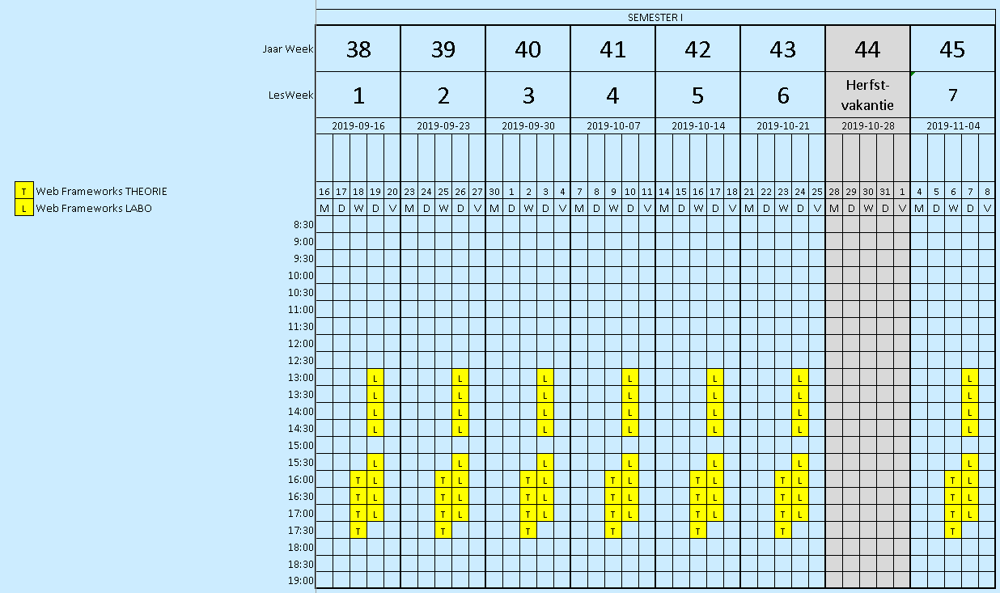

# WebFrameworks Deel I (26543/1700/1920/1/00)

## Korte omschrijving

In het vak web frameworks leer je om op basis van de modernste frameworks en volgens de meest gangbare 'good practices' om een volwaardige en dynamische webtoepassing te maken.

## Kalender

(Onder voorbehoud)

## Algemeenheden cursus (Deel I)

|                                |                                   |
| ------------------------------ | --------------------------------- |
| Studieomvang                   | 3 studiepunten                    |
| Onderwijstalen                 | Nederlands                        |
| Totale studietijd              | 75 uren                           |
| Hoorcolleges                   | 12 uren                           |
| Practicum en/of Oefeningen     | 12 uren                           |
| Werktijd buiten de contacturen | 51 uren                           |
| Volgtijdelijkheid              | Introduction Webtechnology [8532] |
| ECTS                           | [Link](https://ects.ap.be/en)     |

## Leerdoelen (Deel I)

| Code     | Omschrijving                                                                                                                 |
| -------- | ---------------------------------------------------------------------------------------------------------------------------- |
| TI_LD181 | Identificeert de meest gebruikte technieken en programmeertalen voor het ontwikkelen van dynamische webtoepassingen.	Nvt	ALG |
| TI_LD480 | Past de principes toe van asynchroon programmeren in functie van webtoepassingen.	Nvt	ALG                                    |
| TI_LD481 | Beheert software projecten in Git en GitHub.	Nvt	ALG                                                                         |
| TI_LD482 | Ontwikkelt een webtoepassing op basis van een gegeven ontwerp.	Nvt	ALG                                                       |
| TI_LD484 | Gebruikt HTML en CSS voor het ontwikkelen van een webtoepassing	Nvt	ALG                                                      |
| TI_LD485 | Gebruikt JavaScript/TypeScript voor het ontwikkelen van een webtoepassing	Nvt	ALG                                            |
| TI_LD486 | Gebruikt JSON en XML voor het ontwikkelen van een webtoepassing.	Nvt	ALG                                                     |
| TI_LD487 | Gebruikt NodeJS voor het ontwikkeling van een webtoepassing.	Nvt	ALG                                                         |
| TI_LD488 | Integreert verschillende componenten in een volledige webtoepassing.	Nvt	ALG                                                 |

## Leerinhoud (Deel I)

- Advanced topics in JavaScript, TypeScript
- Advanced topics in HTML5 en CSS3
- NodeJS
- Gebruik JSON in ontwikkeling van webtoepassingen
- Angular
- React

## Evaluatie

- Enkel op het examen

## Toetsing (Beide delen)

- 100% Vaardigheidstoets tijdens digitaal examen van 240 min
