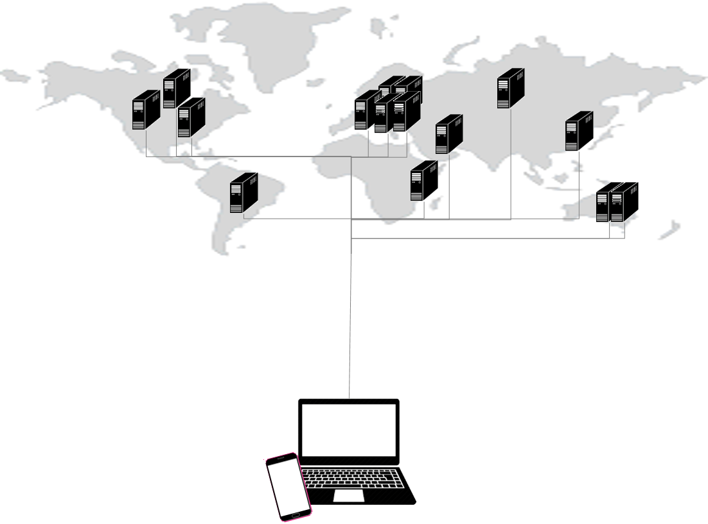
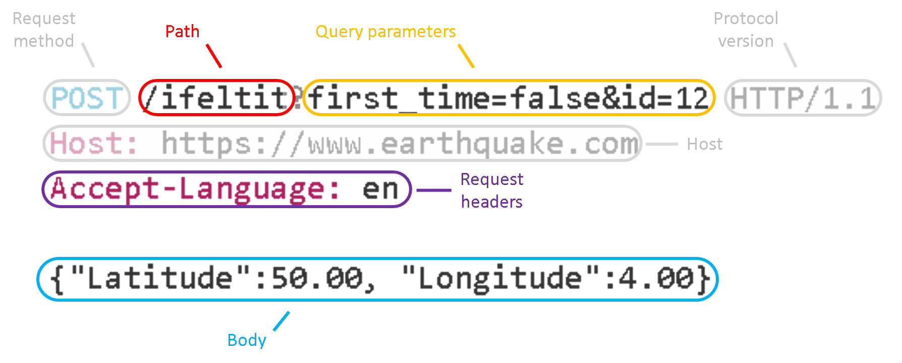

# WebFrameworks Deel I (26543/1700/1920/1/00)

## Fundamentals Web Technology

In this section we will quickly review some basics that ought to be common knowledge

### Clients and Servers

The internet is a hodgepodge of networked clients and servers. The figure below depicts a single client accessing multiple servers:



The client can requests information from the server in the form of HTTP requests, where HTTP is the protocol commonly used. After leaving the client the HTTP request is being routed (dispatched) by an Internet Service Provider (ISP). The server receives the message, decodes it and maybe decides to send a reply to the client.

<details><summary>Help I forgot about this&hellip;</summary>Information endpoints are called sockets and the <a href="https://en.wikipedia.org/wiki/Network_socket">Wikipedia page for 'Network socket'</a> is the best way to refresh your memory on the topic of clients and servers.</details><br>

### The HTTP Request

Here is an example of an HTTP request as composed by an instance of the Chrome web browser on the client computer:

```http
GET https://start.ap.be/ HTTP/1.1
Host: start.ap.be
Connection: keep-alive
Cache-Control: max-age=0
Upgrade-Insecure-Requests: 1
User-Agent: Mozilla/5.0 (Windows NT 10.0; Win64; x64) AppleWebKit/537.36 (KHTML, like Gecko) Chrome/76.0.3809.132 Safari/537.36
Sec-Fetch-Mode: navigate
Sec-Fetch-User: ?1
Accept: text/html,application/xhtml+xml,application/xml;q=0.9,image/webp,image/apng,*/*;q=0.8,application/signed-exchange;v=b3
Sec-Fetch-Site: none
Accept-Encoding: gzip, deflate, br
Accept-Language: nl-BE,nl-NL;q=0.9,nl;q=0.8,en-US;q=0.7,en;q=0.6,de;q=0.5
Cookie: _ga=GA1.2.851859371.1547734380; _gcl_au=1.1.1660610559.1568556813; _gid=GA1.2.195014476.1568556813
```

and here is the reply from the server:

```http
HTTP/1.1 200 OK
Server: nginx
Date: Sun, 15 Sep 2019 16:04:16 GMT
Content-Type: text/html; charset=UTF-8
Connection: keep-alive
X-Powered-By: PHP/5.4.17
X-Proxy-Cache: BYPASS
Content-Length: 5141

<!DOCTYPE html PUBLIC "-//W3C//DTD XHTML+RDFa 1.0//EN" "http://www.w3.org/MarkUp/DTD/xhtml-rdfa-1.dtd">
<html>
[...]
</html>
```

Most of the information being sent back and forth is redundant and is there only to generate heat (if you are wondering about climate change). If we focus on the actual information that matters, we note that there are four distinct places in the HTTP request that can hold custom business logic:



It is up to the server to decide how to read and parse the HTTP request which, in the end, is nothing more than a text message.

<details><summary>Nerd stuff</summary>
Interested in learning about the dynamics of client-server communincation? Here is how you can quickly setup a server and client in python so that you retain full control of the messaging process:

```python (server)
#!/usr/bin/env python3

import socket

HOST = '127.0.0.1'  # Standard loopback interface address (localhost)
PORT = 65432        # Port to listen on (non-privileged ports are > 1023)

with socket.socket(socket.AF_INET, socket.SOCK_STREAM) as s:
    s.bind((HOST, PORT))
    s.listen()
    conn, addr = s.accept()
    with conn:
        print('Connected by', addr)
        while True:
            data = conn.recv(1024)
            if not data:
                break
            conn.sendall(data)
```

```python (client)
#!/usr/bin/env python3

import socket

HOST = '127.0.0.1'  # The server's hostname or IP address
PORT = 65432        # The port used by the server

with socket.socket(socket.AF_INET, socket.SOCK_STREAM) as s:
    s.connect((HOST, PORT))
    s.sendall(b'Hello, world')
    data = s.recv(1024)

print('Received', repr(data))
```

For more details visit [this page](https://realpython.com/python-sockets/#echo-client). We will see a "Hello world" example in Node.js later in this course.
</details><br/>

