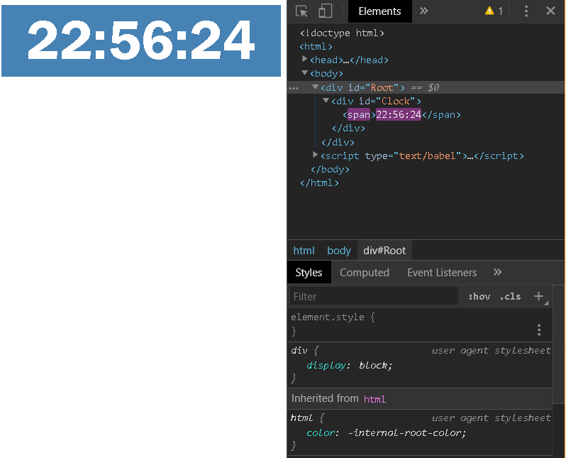
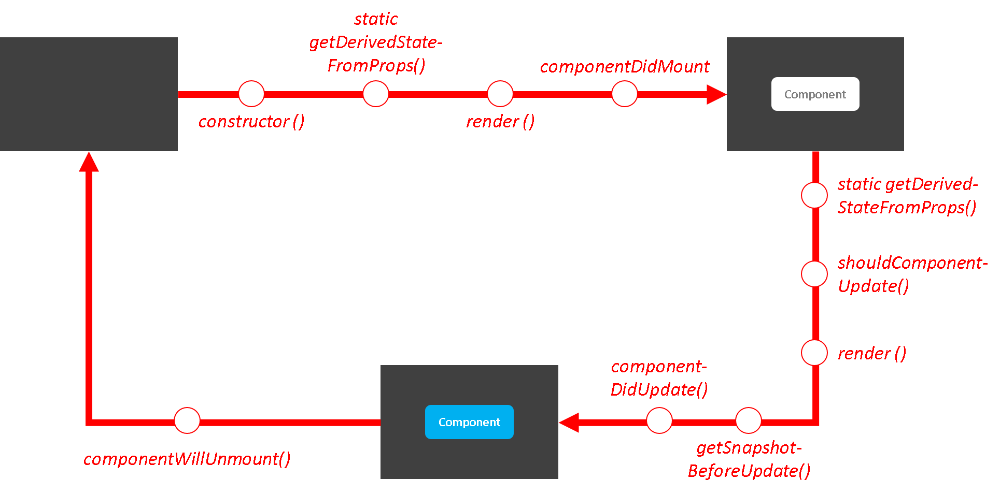
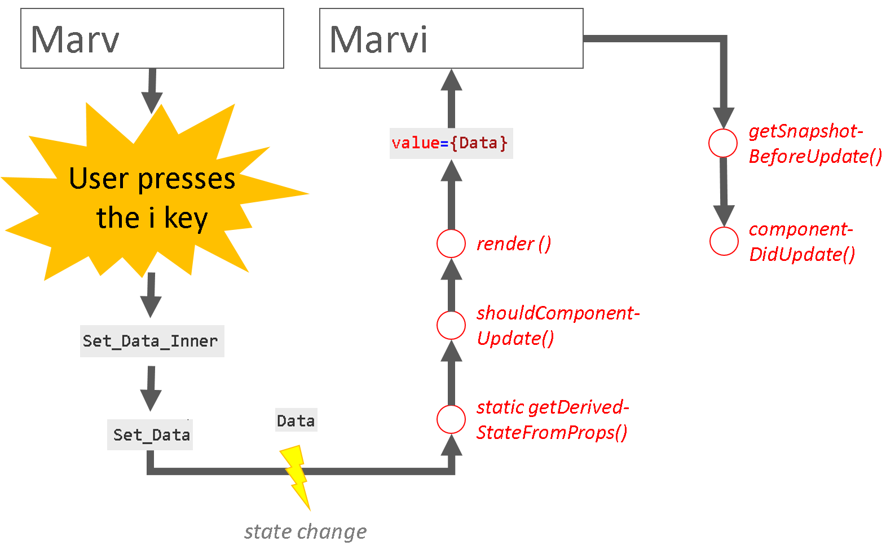
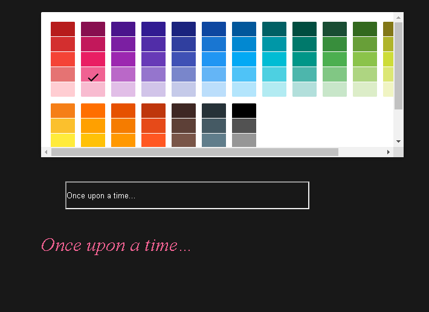

# WebFrameworks Deel I (26543/1700/1920/1/00)

## React Advanced

### Virtual DOM

The Virtual DOM is, as mentioned before, a sort of 'mental' map of the actual DOM and React is responsible for only updating those elements that require updating. We can demonstrate this with a simple app that displays the clock (see [Ex_03](WF_I_Ex_03_Clock.md)):



Notice in the image above, that only the span element gets updated (indicated in purple in Chrome's Dev Tools), not the rest of the HTML. Deciding which screen element to update from the Virtual DOM is a very important function of the React framework. The idea is to let React do its job and be very explicit in telling it when you want to change something.

### The Component Life cycle

We have already discussed the most important life cycle method, namely `render()` (also the only one that is compulsory), but there are others:



Each of the above methods can be overridden. The most popular is the `componentDidMount` method. As the name suggests, it is being called when the component is fully rendered (see [Ex_03](WF_I_Ex_03_Clock.md)). You can use [this interactive diagram](http://projects.wojtekmaj.pl/react-lifecycle-methods-diagram/) as a reference for the other methods.

### A Basic Form

The best way to understand the update mechanism of React is by creating a form and observing its behavior:

```jsx
import React, { useState } from 'react';

export const NameForm = () => {
	const [Data, Set_Data] = useState(null);

	const Set_Data_Inner = iEvent => {
		Set_Data(iEvent.target.value);
	};

	return (
		<form>
			<input
				Name="Name"
				value={Data}
				onChange={Set_Data_Inner}
			/>
		</form>
	);
}
```

Observe how, in the above form, `Data` is being read from the state (which for functional components uses React's state hook `useState`) upon rendering the `<input />` element. When the user changes the text in the  `<input />` element, the `Set_Data_Inner()` method is being evoked, which on it's turn executes the `Set_Data` method and changes the state. When the state changes, React is being triggered to re-render (i.e. update) the component, setting the value attribute of the `<input />` element to its new value. If that was a bit much, let us slow-down the moment that the user presses the `i` key while entering a new name:



### A Component Affecting it's Parent

We have already seen examples where a parent component manipulates a child component through the use of props. How does it work the other way around? What if a child component wants to trigger something in a parents component?

Suppose we have the following app:



Both the `Color` and `Text` components influence their parent, `App`. Remember that components can have a state and means to manipulate that state. In this situation, `App` will have a state called `Color` and one called `Text`. Suppose that `App` is a functional component so it will also have the methods `Set_Color` and `Set_Text` defined. How can the child components `Color` and `Text` change the state of their parent? The answer is simple: `App` sends the state-updating methods down to it's children by way of props! Let us try this:

```jsx - App.js
import React, { useState } from "react";
import "./App.css";
import { Color as ColorComponent } from "./Color";
import { Text as TextComponent } from "./Text";

export function App() {
	const [Color, Set_Color] = useState("#f06292");
	const [Text, Set_Text] = useState("Once upon a time");

	return (
		<div id="App">
			<ColorComponent Color={Color} Set_Color={Set_Color} />
			<TextComponent Text={Text} Set_Text={Set_Text} />
			<span style={{ color: Color }}>{Text}</span>

		</div>
	);
}
```

```jsx - Color.js
import React from "react";
import { SwatchesPicker } from "react-color";

export const Color = ({ Color, Set_Color }) => {
	const Set_Color_Inner = Color_Object => Set_Color(Color_Object.hex);

	return <SwatchesPicker color={Color} onChangeComplete={Set_Color_Inner} />;
};
```

```jsx
import React from "react";

export const Text = ({Text, Set_Text}) => {
	const Set_Text_Inner = iEvent => {
		Set_Text(iEvent.target.value);
	};

	return (
		<form>
			<input value={Text} onChange={Set_Text_Inner} />
		</form>
	);
};
```

### Creating a Context

Sometimes, it is important to have a memory that spans across multiple components. For example, the user currently logged in and the language settings of the web site. These are variable that one may wish to access from anywhere in the Single Page Application (SPA).

We can build a context like this:

```jsx
import React from "react";
import ReactDOM from "react-dom";
import { App } from "./App";
import { GlobalContexProvider } from "./cnt/GlobalContext";

ReactDOM.render(
	<GlobalContexProvider>
		<App />
	</GlobalContexProvider>,
	document.querySelector("#root")
);
```

In the above code, `GlobalContexProvider` is *not* a part of the React framework. Instead it is a context that we need to define. Let us take a look at `GlobalContext.js`:

```jsx
import React, { createContext, useReducer } from "react";
import { GlobalReducer } from "../red/GlobalReducer";
import { Lang, Translate } from "../utl/trn";

import Cfg from "../dat/cfg.json";

export const GlobalContext = new createContext();

export const GlobalContexProvider = ({ children }) => {
	const [Global, Global_Dispatch] = useReducer(GlobalReducer, {
		User: null,
		Language: Lang.nl_be
	});

	return (
		<GlobalContext.Provider value={{ Global, Global_Dispatch }}>
			{children}
		</GlobalContext.Provider>
	);
};
```

This code is quite complex so let us go over it line by line. We notice that:

> One can also create React components that have a start tag, an en tag and an inner body
> Not only visual elements are coded in React Components, also application logic can be build into React components.


Hence, `createContext` can be seen as a context provider factory. The `value` publish the two variables `{{Global, Global_Dispatch}}` following the same principle of the `useState` function. `Global` is the variable holding the data. As you can see, the context is being initialized with an empty `User` and the dutch language. `Global_Dispatch` is a generic function that allows to change the context. We will see its inner workings in a second.

In the above example, we are building this structure internally:

```html
<GlobalContexProvider>
	<GlobalContext.Provider>
		{/* OTHER COMPONENTS HERE */}
	</GlobalContext.Provider>
</GlobalContexProvider>
```

...but we are simply setting the context as such:

```html
<GlobalContexProvider>
	{/* OTHER COMPONENTS HERE */}
</GlobalContexProvider>
```

All the components that go between the `GlobalContexProvider` tags now have acces to the `User` and the `Language`.

### Accessing the Context

To access the context in read-only mode, we can now do the following:

```jsx - App.js
import React, {useContext} from "react";
import { GlobalContext } from "./cnt/GlobalContext";
import { Translate } from "../utl/trn";

export const App = () => {
	const { Global } = useContext(GlobalContext);

	return <span>{Translate("Welcome", Global.Language)}</span>;
}
```

### Changing the Context

Setting the context is generally associated with some application logic. We have seen some simple examples in the case of a component state. However, in more realistic scenarios, things get more complicated. As a consequence you have code for rendering views and logic intertwined in one file, and that is generally not a good idea.

> It is better to keep the application logic separate

Hence the use of a **dispatcher**:


```jsx - App.js
import React, {useContext} from "react";
import { GlobalContext } from "./cnt/GlobalContext";
import { Actions } from "../utl/bus";
import { Translate } from "../utl/trn";

export const App = () => {
	const On_Lang_Toggle = iEvent => {
		iEvent.preventDefault();
		Global_Dispatch({ Type: Actions.Toggle_Language });
	};

	const { Global, Global_Dispatch } = useContext(GlobalContext);

	return <div>
			   <span>{Translate("Welcome", Global.Language)}</span>
			   <button onClick={On_Lang_Toggle}>{Global.Language)}</button>
		   </div>;
}
```

Upon clicking the button, the `On_Lang_Toggle` method gets executed. Herein, the event propagation is being halted and the method to set the context (`Global_Dispatch`) is being called with as argument an object (`{ Type: Actions.Toggle_Language }`). This object is telling the dispatcher what the requested action is. In this case, the action is a string, kept inside a enumerator in a separate file for convenience:

```js
export const Actions = Object.freeze({
	Toggle_Language: "Toggle_Language",
	// Many more actions here
});
```

But who is listening on the other end? Who is interpreting the `{ Type: Actions.Toggle_Language }` object? That will be the **reducer**.

### The Reducer

The reducer has several functions and was originally imported from external plu-ins such as Redux, but these days, this is all built-in in React. Let us re-visit this code where you notice we skipped the `useReducer` method until now:

```jsx
import React, { createContext, useReducer } from "react";
import { GlobalReducer } from "../red/GlobalReducer";
import { Lang, Translate } from "../utl/trn";

import Cfg from "../dat/cfg.json";

export const GlobalContext = new createContext();

export const GlobalContexProvider = ({ children }) => {
	const [Global, Global_Dispatch] = useReducer(GlobalReducer, {
		User: null,
		Language: Lang.nl_be
	});

	return (
		<GlobalContext.Provider value={{ Global, Global_Dispatch }}>
			{children}
		</GlobalContext.Provider>
	);
};
```

Instead of `useReducer`, we could have use the `useContext` hook. In that case the functionality is similar to that of `useState`. As mentioned above, the advantage of using `useReducer` is the separation of the application logic from the component rendering a bit more. Let us create out reducer step-by-step:

```jsx - GlobalReducer.js
export const GlobalReducer = (state, action) => {
	// logic here
}
```

A reducer is thus a function. The two arguments to the function are the `state` and the `action` to be executed. We never pass in the state manually to the reducer, the framework is doing that for us. We only passed the action:

```jsx
Global_Dispatch({ Type: Actions.Toggle_Language });
```

From within the reducer, we can now examine the `action` object and act accordingly to update the state:

```jsx
export const GlobalReducer = (state, action) => {
	switch (action.Type) {
		// Many other cases here
		case Actions.Toggle_Language:
			let New_Language = null;

			if (state.Language == Languages.Dutch) {
				New_Language = Languages.Chinese
			} else {
				New_Language = Languages.Dutch
			}

			return {
				...state,
				...{ Language: New_Language }
			});
	}
}
```

This code would otherwise have end up next within the component renderer, which would not be OK, especially if the logic becomes more ellaborate.
