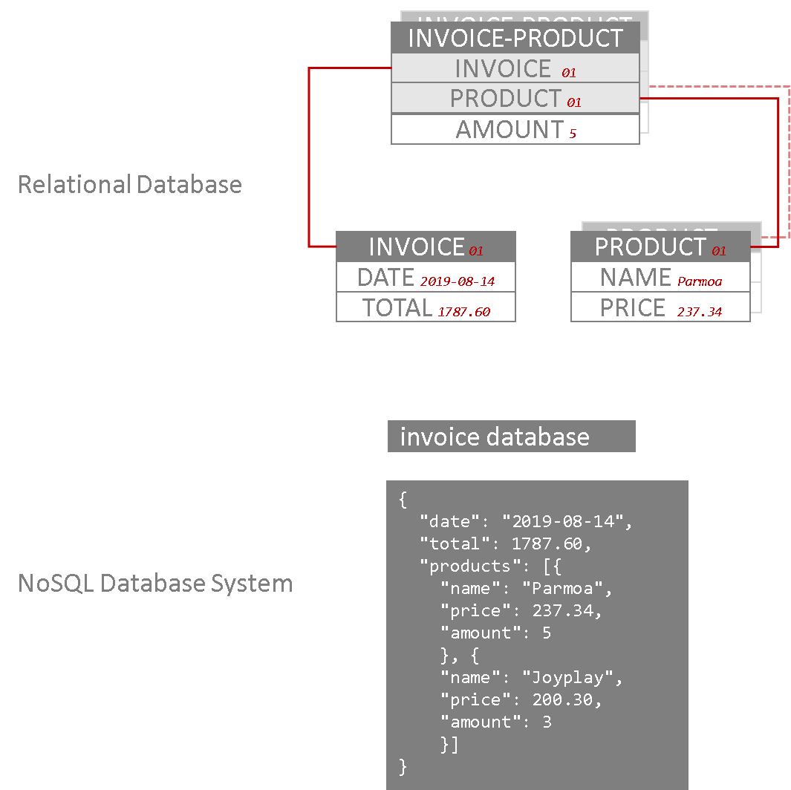
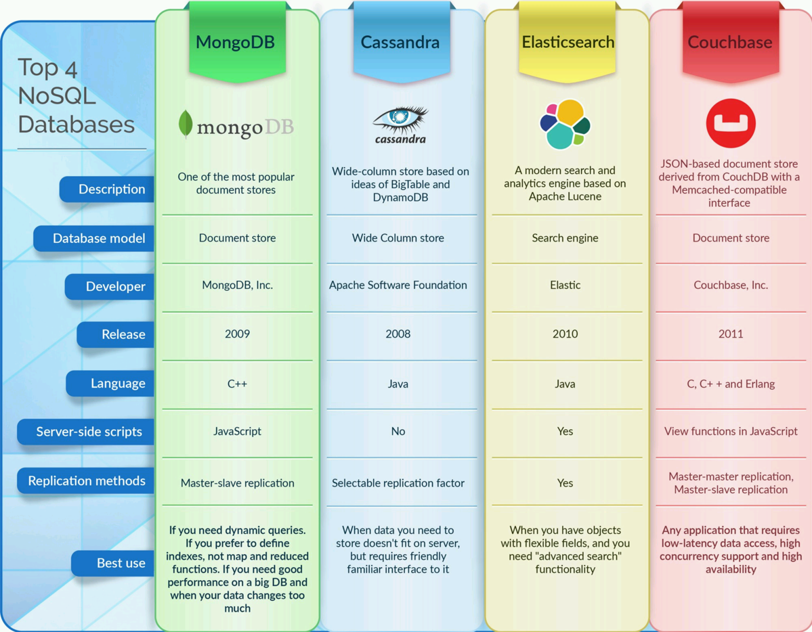
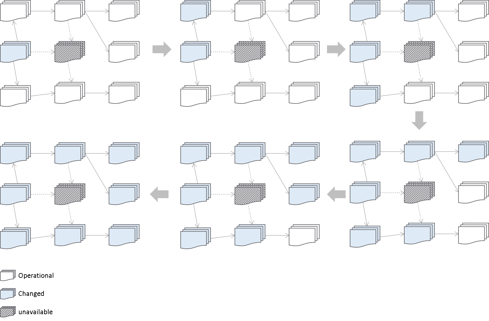
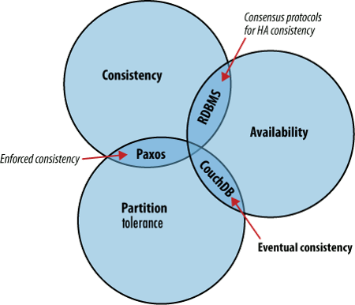
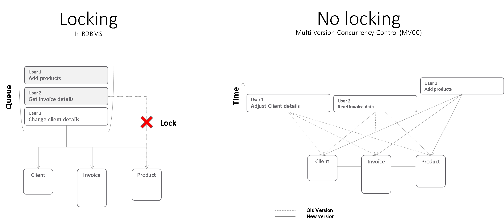

# Web Frameworks PArt I (26543/1700/1920/1/00)

## CouchDB Basics

### Introduction to NoSQL Database Systems (NoSQL DBSs)

NoSQL database systems are called this way because the goal originally was to create databases where SQL is no longer needed. Especially driven by the difficulty for companies to hire DB admins (scarce and expensive) there was a search for alternatives that could also handle big data.

In comparison with relational databases management systems (RDBMS), NoSQL database systems are **more scalable**, **more modular** and **simpler** to use. Instead of tables linked by way of foreign keys, a NoSQL database system consists of so-called documents each of which contains all the information to represent a real-world entity. Hence, a NoSQL database system is also called a **Document Store**. Let us visualize the difference between relational and NoSQL DBSs:

Notice that the concept of tables is complete abandonned. For a simple invoice with two products, you need 5 fields across 3 tables in a RDBMS. The same information is capture together as one document in the NosSQL system. Notice also the weird terminology of an *invoice database*. Indeed documents linked a to same entity are called a database (mind that this is the term used typically for CouchDB, other NoSQL system speak of collections).

Furthermore, mind that in the NoSQL system there is the possibility to have arrays, an array of objects, nested arrays, etc &hellip; Also very different is the fact that in the NoSQL system there is absolutely **no type definition**! There is not even a validation whether the fields are all present inside a document. You might indeed have an invoice where the data field is missing, that is not just the value but the entire field, something that would never be possible in a RDBMS. In short, we can say that **the NoSQL system has no schema**! To top it off, there are no transactions anymore! The only difficulty of NoSQL systems is coming to terms with the above. In its use NoSQL is definitely simpler, it is just a matter to getting used to it.

Here is a [very educational video](https://youtu.be/b2F-DItXtZs) on the topic of NoSQL versus RDBMS.

### Top NoSQL Vendors

There are several NoSQL database systems of which the most popular are shown here:

So even though CouchDB isn't the most popular, it has many advantages that makes it a good choice when learning the principle of NoSQL.

### Scalability

The power of a database lies in its scalability. If a database does not support web-scale, it might not be convenient for your particular web application. In NoSQL anyone can scale up a database in a matter of minutes from thousands to millions of users. It is easy to make the nodes in the distributed network independent so that a change somewhere in the electronic_network propagates autonomously. Such operation to synchronize two NoSQL databases is called a **replication** and the two coresponding databases are **replicas** of each other. Indeed, in this model **all of the data** resides **on every node**.

A hard-core RDBMS admin immediately sees issues with this transaction-free approach, the biggest one being the lack of consistency. Indeed, there are points in time in which two databases (or DB systems) in the above schema do not match (are *inconsistent*). Yet eventually, all things work out fine, hence the term **eventual consistency**.

### The CAP Theorem

This is a theoretical principle that says: you cannot have it all. You cannot have a database that remains **consistent** throughout (**C**), where the data remains **available** at all times (**A**) and where the data is **partitioned** (**P**) across many servers.

CouchDB chose for scalability and availability, at the cost of consistency. So yes, two products might for example have different prices during a time span of a few seconds, who cares? Yes, the address of that customer might not yet have incorporated the changes that happened a few seconds ago somewhere on the other side of the globe, who cares. The price you have to pay to make a RDBMS scalable is far greater! Not only can you take this literally, there is the issue of locking:

In a RDBMS, you let the users wait (lock) during an update operation until all affected tabels get released (unlocked). Changing a client (e.g .continuation of a company under a different name and number) results in all tabels being queued for a change and all users have to wait for the transaction to finish. When the load reaches a critical point, the RDBMS will start spending more time in the management of the queue than in doing the work. In a Multi-Version Concurrency Control (MVCC) system such as the one adopted by CouchDB, it's OK that at a certain point there is some inconsistency. The processor can always do useful work and data (OK, maybe a slightly outdated version of it) is always available.

### Revisions

The clue to make this all work is the use of an intelligent versioning system. It is simple and comparable to github with one exception:

> CouchDB does not guarantee that all versions will remain available forever!
