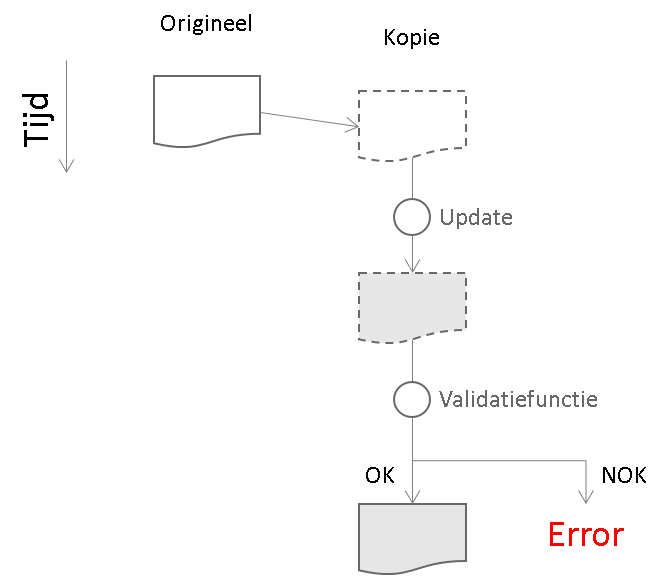
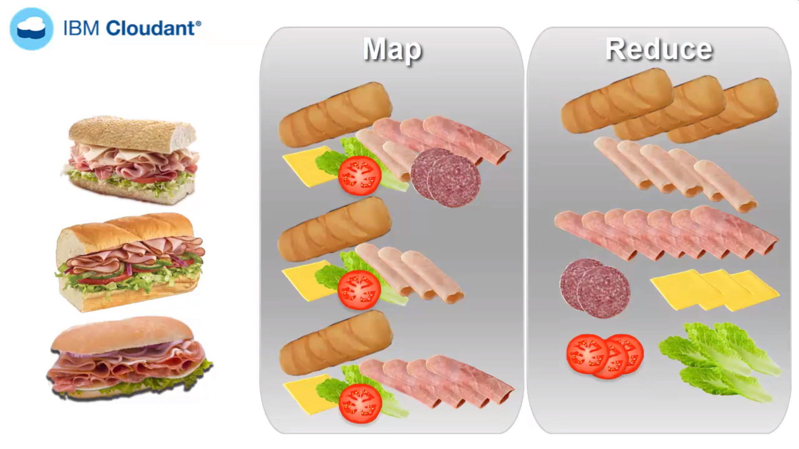
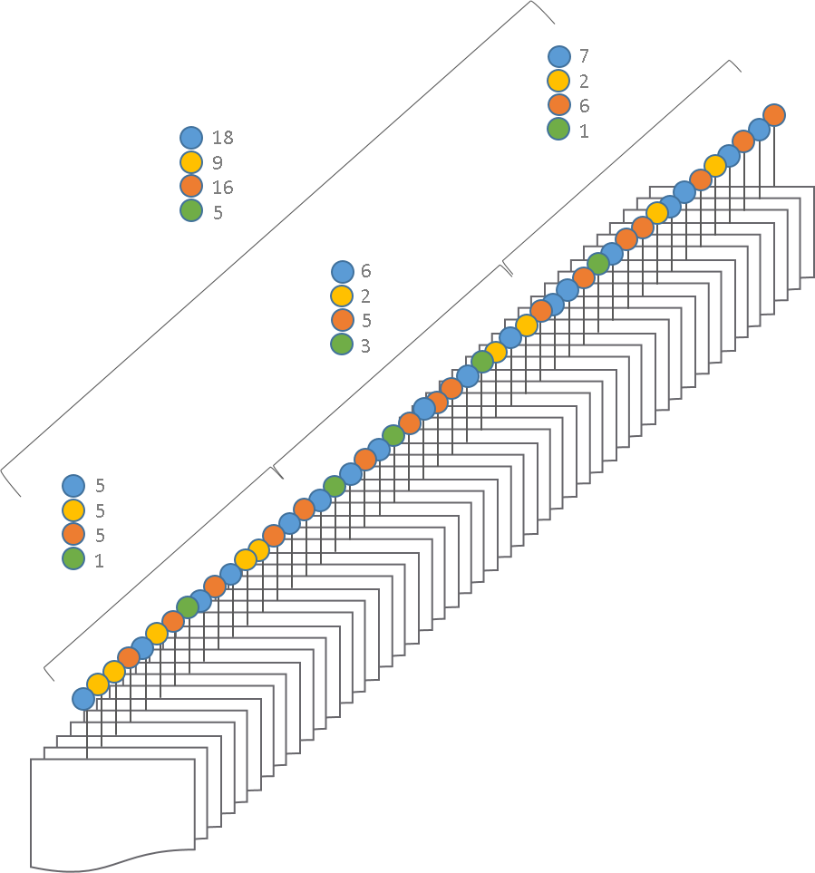
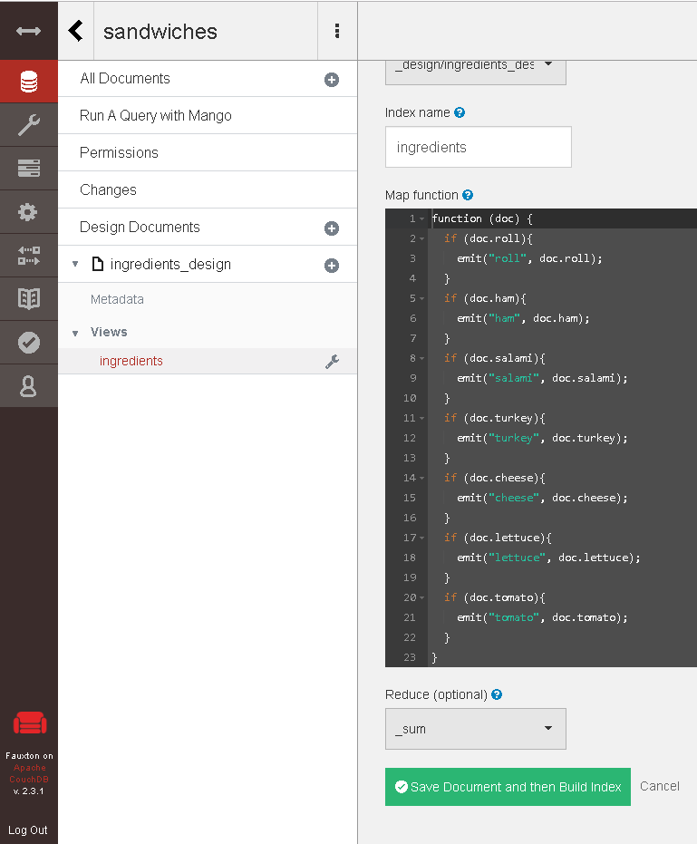
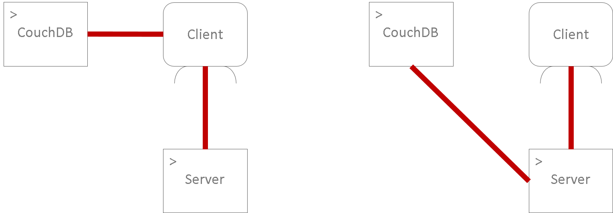

# Web Frameworks Deel I (26543/1700/1920/1/00)

## CouchDB Advanced and React

### Design Documents

Design documents govern everything that belongs to the realm of metadata:

- View Functions
- Show Functions
- List Functions
- Update Functions
- Filter Functions
- Validate Document Update Functions

Reference material on design documents [here](https://docs.couchdb.org/en/stable/ddocs/index.html).

We will be talking here mainly about views, but validation is also an important part of the NoSQL administration:



They allow to hook on the update process of a document. Similarly, replication operations can be customized.

### Views

Similar to RDBMS, NoSQL systems also have **views**. These allow you to do the following:

- **Display** the data inside documents
- **Extraction** of certain values of documents
- **Filter** documents based on a set of criteria
- **Indexing** documents based on some criteria
- **Aggregate** and transform data

Views in CouchDB uses the Map-Reduce paradigm.

### The Map-Reduce Paradigm

This paradigm is used to crunch large datasets in a distributed system. It's a two-phase process. The first phase is the Map phase. It converts documents to a set of key-value pairs. In Map-reduce parlance, we say it 'emits' key value pairs. It the second phase the key-value pairs are aggregated (grouped) by their keys.


<small>[Bron](https://www.youtube.com/watch?v=lgWy7BwIKKQ)</small>

In CouchDB this can be implemented using Javascript functions called View functions:


### Map function

Suppose that for each document in our sandwich example, we wish to emit each ingredient:

```js
function (doc) {
  if (doc.roll){
    emit("roll", doc.roll);
  }
  if (doc.ham){
    emit("ham", doc.ham);
  }
  if (doc.salami){
    emit("salami", doc.salami);
  }
  if (doc.turkey){
    emit("turkey", doc.turkey);
  }
  if (doc.cheese){
    emit("cheese", doc.cheese);
  }
  if (doc.lettuce){
    emit("lettuce", doc.lettuce);
  }
  if (doc.tomato){
    emit("tomato", doc.tomato);
  }
}
```

Notice that the map function is written in JavaScript.

### (Re-)Reduce

Here is a visual drawing to explain re-reduce and the difference with reduce:



The first parallel operation on the emitted flag is counting the number per color. This is the work of the reduce function. The re-reduce function is the second step (and all following steps!) in the aggregation and instead of counting, it sums up the result of previous step. If the re-reduce function were the same as the reduce function, here, the result would be for the four colors: {blue:3, yellow:3, orange:3, green:3}. Hence the need to be able to define both separately.

### Creating and Calling a View

Views can be created using the Fauxton UI or programmatically through the API. The easiest way to learn is through the Fauxton UI.



For calling a View, see this [reference page](https://docs.couchdb.org/en/stable/api/ddoc/views.html#querying-views-and-indexes) and other for more details.

### Building a React App

There are two approaches. One is to build an application stack where CouchDB is called directly from the client. It is fast but has some disadvantages regarding mainly security and programming flexibility. The alternative safer way is to build an API that serves as middleware between the client and the CouchDB:




