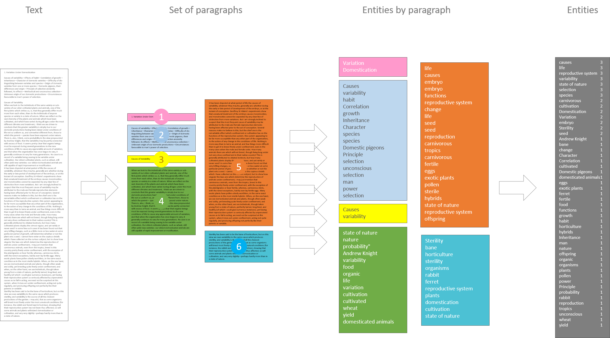
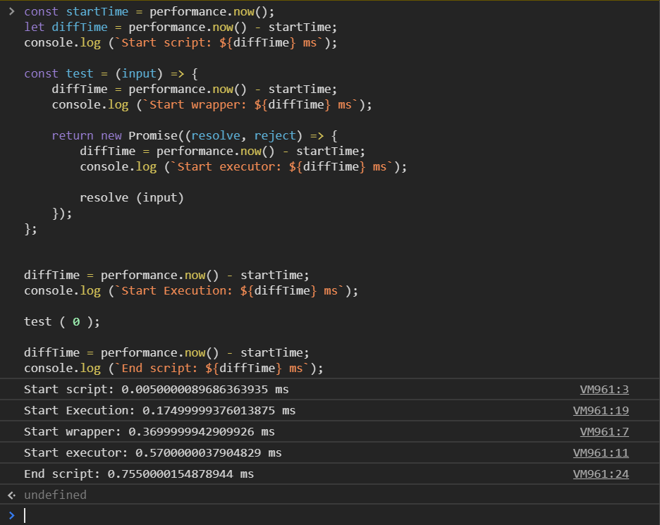
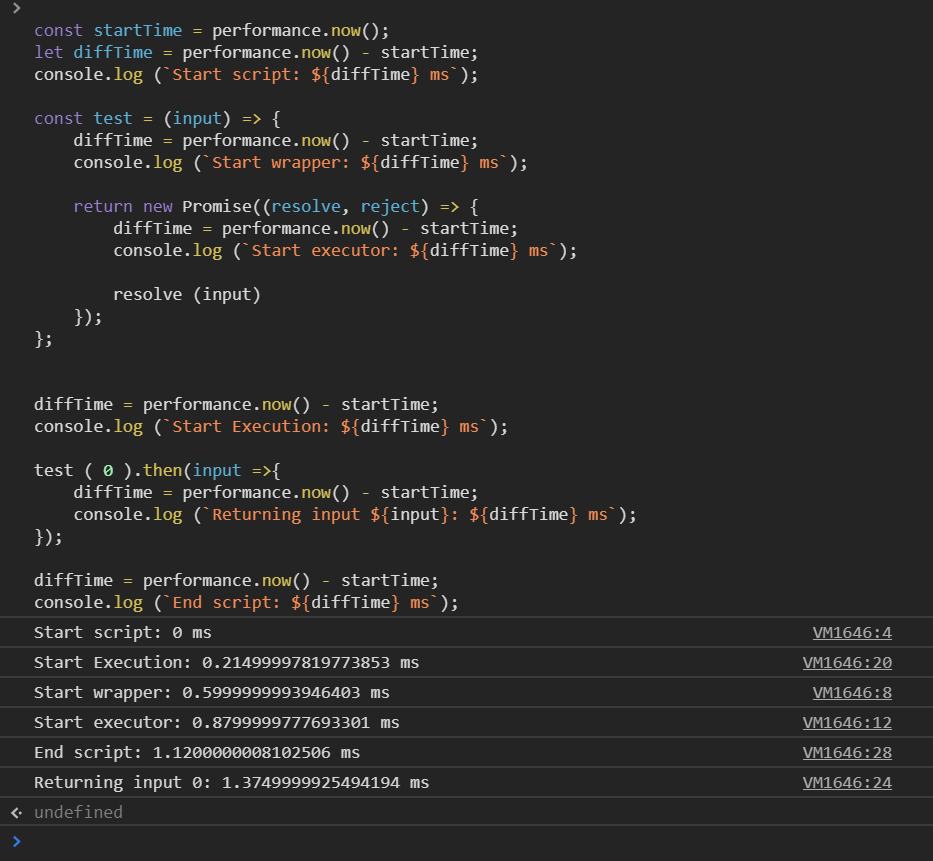

# Web Frameworks Deel I (26543/1700/1920/1/00)

## Promises Basics

### The NLP Case Study

In web development practice, you will frequently encounter asynchronous calls. A function call is asynchronous when you do not want to wait for the function to return a value. To be more precise: promises are useful whenever you are interested in the return value, but you do not want to wait for it. You want to continue with your regular work and let the Javascript engine pick up at a certain point in the script whenever the function returns. Let us consider an example. Suppose you want to have a web application subject text to a NLP algorithm thats extracts entities from it:



You start off with a piece of text (shown on the far left). To analyze it, you could choose either to develop your own algorithm using some external library or use an external API. Either way, you would want to follow these steps:

1. Do some pre-processing of the text (remove punctuation)
2. Break the text down into smaller parts (here paragraphs)
3. Send all the parts *in parallel* (i.e. simultaneously) to the algorithm
4. Wait for the last result to arrive (here, the return value is a set of entties)
5. Join the results (i.e. create a list of unique entities and their frequency of occurrence)

### Introduction to promises

So promises are the answer to solve the previously described situation of delayed or asynchronous workload. One can regard a promise as a wrapper around a regular function that adds state to that function. Here are the states in which a promise can find itself:

- **pending**: not yet completed
- **fulfilled**: completed successfully
- **rejected**: completed with an error

Instead of *completed* we use the term **settled**.

### Pretend Multi-threaded

Unlike other (some would argue *real*) programming languages, JavaScript is designed to be single threaded, not multi-threaded. This means that JavaScript cannot programmatically manage multiple threads running scripts independently and simultaneously. How is this even possible? How can we have promises in a single-threaded scripting language? And more, how can we have events?

> Differences between promises and events:
> 
> While an event can fire multiple time, a promise can only settle once
> 
> A `resolve` or `reject` callback that has been added to a promise after it has already settled will still appropriately be executed

### Initializing a Promise

You can initialize a promise through the `Promise` interface:

```js
const DANDELION_ENT_URL = "https://api.dandelion.eu/datatxt/nex/v1";


const ajax = (resolve, reject) => {
	const xhr = new XMLHttpRequest();
	const url = new URL(DANDELION_ENT_URL);

	xhr.open("GET", url);
	xhr.onload = () => resolve({ id, resp: xhr.responseText });
	xhr.onerror = () => reject({ id, stat: xhr.statusText });
	xhr.send();
}

const ajaxPromise = new Promise(ajax);
```

Here, `ajax` is called the executor function. Executor functions should always accept two function arguments. One (`resolve`) is the function to be return to whenever the operation was successful, the other (`reject`) when is was unsuccessful. These two settlement functions (`resolve` and `reject`) *replace* the standard `return` clause of a function to separate the positive from the negative flow.

### Wrapping Promises

The executor function takes on the two callbacks, but nothing else. In order to have a proper function, you would want to have more input arguments, right? To achieve that, you can wrap the promise inside another function. Let us apply this idea to the use case introduced above.

```js
const DANDELION_ENT_URL = "https://api.dandelion.eu/datatxt/nex/v1";

const processParagraph = (paragraph, index) => {
	return new Promise((resolve, reject) => {
		const xhr = new XMLHttpRequest();
		const url = new URL(DANDELION_ENT_URL);
		url.searchParams.set("text", paragraph);
		url.searchParams.set("lang", "en");
		url.searchParams.set("include", "types,categories");
		url.searchParams.set("token", "YOUR TOKEN HERE");

		xhr.open("GET", url);
		xhr.onload = () => resolve({ index, resp: xhr.responseText });
		xhr.onerror = () => reject({ index, stat: xhr.statusText });
		xhr.send();
	});
};
```

So the wrapper function `processParagraph` takes on the necessary arguments and, within its scope defines a promise that can consume these arguments.  The input arguments are the `paragraph` for which the entities need to be extracted and the index of the paragraph. The executor function of the promise is written inline and forms a wrapper around JavaScript's `XMLHttpRequest` class and corresponding `send` method. Notice that the executor function does not have any `return` clause, but uses the `resolve` and `reject` callbacks instead.

### Executing a promise

What happens if you run the above code in your browser's development tools, followed by a call to `processParagraph`?

```js
processParagraph("This is a test paragraph", 0)
```

This is what you would see *eventually* in case you switched off the internet on your machine:


I say *eventually*, because the `Promise (pending)` message appears immediately, but the error messages appear only after a few seconds! What does it mean? It means that the promise did exactly what it was meant to do, namely execute the code but do not let anyone wait for the results. After executing the above statement, the call to `resolve` or `reject` is being delayed until the JavaScript engine becomes idle. So you could regard the settlement functions as delayed returned clauses.

Let us test this idea by running the following code directly in the developer tools:

```js
const startTime = performance.now();
let diffTime = performance.now() - startTime;
console.log (`Start script: ${diffTime} ms`);

const test = (input) => {
	diffTime = performance.now() - startTime;
	console.log (`Start wrapper: ${diffTime} ms`);

	return new Promise((resolve, reject) => {
		diffTime = performance.now() - startTime;
		console.log (`Start executor: ${diffTime} ms`);

		resolve (input)
	});
};


diffTime = performance.now() - startTime;
console.log (`Start Execution: ${diffTime} ms`);

test ( 0 );

diffTime = performance.now() - startTime;
console.log (`End script: ${diffTime} ms`);
```

Here is the screenshot showing the result:



Oops, what happened? No delay to be seen! The engine executed all the bits in the natural order. This is where many people get lost: the executor function is immediately started, it is the call to the settlement functions that is being delayed, not the execution of the executor function itself! In other words: the engine immediately start executing the asynchronous code but really only goes asynchronous whenever it needs to do so.

### Providing the resolve and reject callbacks

The settlement callbacks can be provided using the `then` respectively `catch` methods of the Promise interface:

```js
const divideAsync = (a, b) => {
	return new Promise((resolve, reject) => {
		if (b === 0) {
			reject("I won't divide by zero.");
		} else {
			resolve(a / b);
		}
	});
};

[3, 0].forEach(divisor => {
	divideAsync(2, divisor)
		.then(res => {
			console.log(res);
		})
		.catch(err => {
			console.error(err);
		});
});
```

As expected, you would get this result:


Notice that this syntax allows for *chaining* multiple `then` clauses, as long as they return a promise themselves:

```js
getUserByEmail(email)
	.then(user => {
		return getCompanyByUser(user);
	})
	.then(company => {
		return getSupplyChainByCompany(company);
	})
	.then(supplyChain => {
		draw(supplyChain);
	})
	.catch(err => {
		console.error(err);
	});
```

The catch clause at the end will catch *any error* that occurred anywhere in the chain. If we now adjust the above call to the `test` wrapper function and include a `then`, we get the following:

```js
const startTime = performance.now();
let diffTime = performance.now() - startTime;
console.log (`Start script: ${diffTime} ms`);

const test = (input) => {
	diffTime = performance.now() - startTime;
	console.log (`Start wrapper: ${diffTime} ms`);

	return new Promise((resolve, reject) => {
		diffTime = performance.now() - startTime;
		console.log (`Start executor: ${diffTime} ms`);

		resolve (input)
	});
};


diffTime = performance.now() - startTime;
console.log (`Start Execution: ${diffTime} ms`);

test ( 0 ).then(input =>{
	diffTime = performance.now() - startTime;
	console.log (`Returning input ${input}: ${diffTime} ms`);
});

diffTime = performance.now() - startTime;
console.log (`End script: ${diffTime} ms`);
```

Now, we see that the callback is being delayed, even though no real async code is being presented.



### Async and await

There exists an alternative for the above chaining syntax:

```js
const getSupplyChainByEmail = async email => {
	try {
		const user = await getUserByEmail(email);
		const company = await getCompanyByUser(user);
		const supplyChain = await getSupplyChainByCompany(company);

		draw(supplyChain);
	} catch {
		console.error(err);
	}
};
```

Notice that the code is a more elegant, but it requires the use of a wrapper function that itself is being turned into a promise by way of the `async` keyword.
